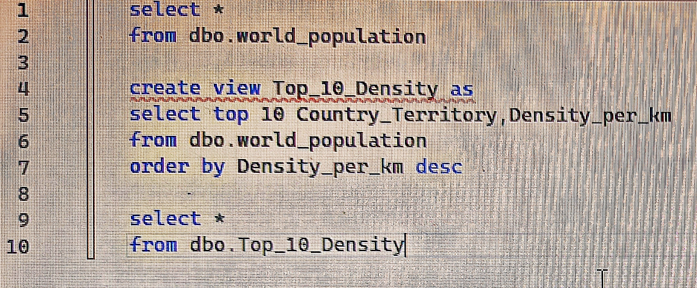
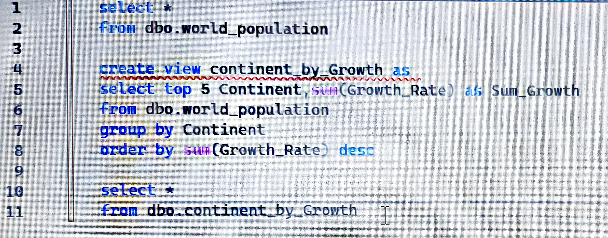
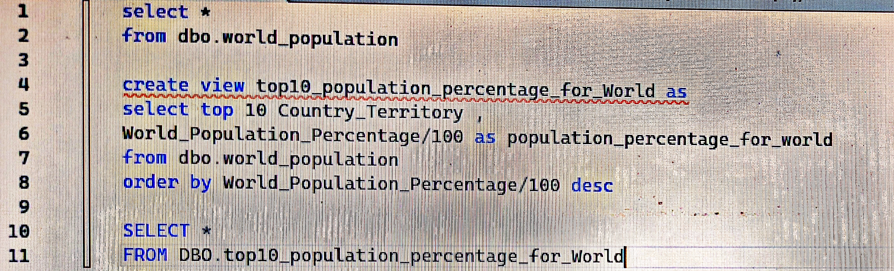
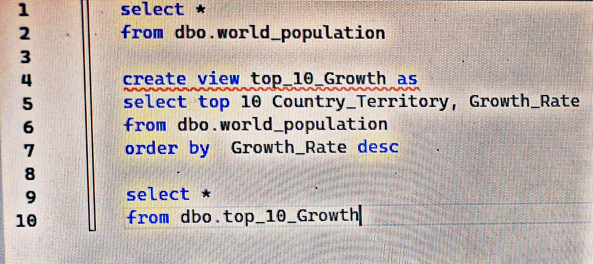

# market_sales_data_analysis_
data analysis project using SQL+Power Bi to explore world population
## Data source :
from kaggel 
## Tools used :
SQL + Power Bi
## Project Question : 
How has the global population changed over time and which region contribute most to this growth ??
## Explore data :
the data contains 235 rows and 17 columns 
## Clean data :
1-unimportant columns were removed from the analysis 

2-removed errors 

3-removed duplicate data 

4-each column was converted to a number , data or text format depending on the column and its contents

5-prepared the dataset for analysis 
## SQL queries used :
Query1: to display countries by population density per km*km

Query2: to diplay continents by growth rate 

Query3: to display countries by population size 

Query4: to dispaly countries by growth rate 

## data analysis :

                                                         Dashboard
